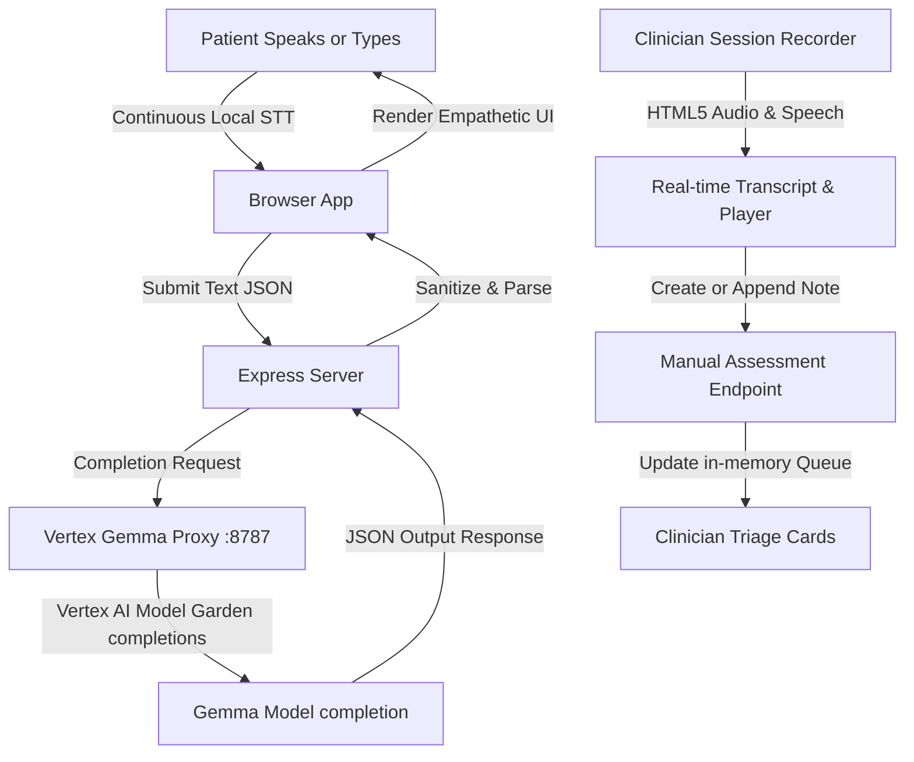

# SwaraSaathi: Dual-Role Clinical Triage & Session Logging Core

SwaraSaathi is a premium, real-time mental health triage engine and clinical consultation logging platform. It serves a dual purpose: providing a calming, supportive journaling space for patients, and empowering clinicians with automated triage assessments, stressor classification, and live consult recording tools.

The entire cognitive reasoning, emotional triage, and clinical analysis are powered by **Google Gemma** running via **GCP Vertex AI Model Garden** through an OpenAI-compatible local proxy.

---

## 🌟 Key Features

### 👤 Patient Portal
* **Infinite Continuous Dictation ("Speak as long as you can"):** Leveraging native browser Speech Recognition (`webkitSpeechRecognition`) with an auto-restart loop, patients can record voice journals infinitely without browser timeouts.
* **Live Transcription Feed:** Patient speech is translated into text and displayed in real-time inside the text editor as they speak.
* **Empathetic AI Feedback:** Gemma analyzes the patient's entry to formulate custom, compassionate responses directly to the patient validating their experience.
* **Speech Synthesis (TTS):** Patients can click "Listen Aloud" to hear Gemma's response spoken in a comforting voice using the browser's speech synthesis engine.

### 🩺 Clinician Dashboard
* **Real-Time Triage Queue:** An interactive patient list displaying identified stressors, detailed clinical notes, risk indicators, and severity distress scores (1 to 100).
* **Live Session Recorder (Up to 30 mins):** Clinicians can record consulting sessions directly from the dashboard. The module utilizes dual capture:
  1. **High-Fidelity Audio Capture:** Uses the browser `MediaRecorder` API to record raw meeting audio and mounts a playback player instantly.
  2. **Real-time Session Transcription:** Transcribes clinician-patient interactions live on screen during the consult.
* **Inline Patient File Builder ("+ Add New Patient"):** Clinicians can toggle to create a brand-new patient file inline (capturing Name, Stressor, and Risk Level), record the consult, and log notes in a single click.
* **Patient Association Engine:** Logs and transcribed interactions are instantly appended directly to the selected patient's active clinician files.

---

## 🤖 Core AI Architecture: Google Gemma + GCP Vertex AI

SwaraSaathi utilizes a modern, **keyless, and Gemini-free backend architecture**:
* **Gemma via Vertex AI Model Garden:** The server communicates directly with your **Gemma** open-weights model (`google/gemma-4-26b-a4b-it-maas` or general Gemma variants) deployed on Vertex AI.
* **Local Proxy Endpoint:** The application routes cognitive reasoning completion queries through a local proxy listening on `http://127.0.0.1:8787/v1/chat/completions`.
* **Browser-Native STT (Speech-to-Text):** Speech transcription is handled entirely on the client side inside the browser. This eliminates the need to upload heavy audio files to your server or configure backend Gemini API keys, ensuring maximum speed, data privacy, and a cost-free audio pipeline.
* **Robust JSON Schema Enforcement:** Gemma is instructed via explicit system prompts to return strictly conforming JSON. The backend sanitizes raw LLM output (stripping markdown ` ```json ` delimiters if returned) and includes a fallback retry mechanism that rolls back formatting parameters if the upstream endpoint returns exceptions.

---

## ⚙️ Project Structure & Flow



---

## 🚀 Running Locally

### Prerequisites
* **Node.js** (v18 or higher recommended)
* A running **Vertex Gemma Proxy** active on `http://127.0.0.1:8787/v1`

### 1. Installation
Clone the repository, navigate into the project directory, and download dependencies:
```bash
cd SwaraSaathi
npm install
```

### 2. Environment Variables
Create or configure a `.env` file in the root of the project:
```env
GEMMA_PROXY_URL=http://127.0.0.1:8787/v1
GEMMA_PROXY_MODEL=google/gemma-4-26b-a4b-it-maas
```
*(Note: No Gemini API Key is required to run this project!)*

### 3. Start Development Server
Run the local compiler and Express server:
```bash
npm run dev
```
Open **`http://localhost:3000`** in your browser (Google Chrome, Microsoft Edge, or Apple Safari are recommended for Speech Recognition support).

### 4. Build for Production
To build and bundle the frontend React assets and the Node/Express server for production deployment:
```bash
npm run build
```
The compiled server and client files will be located in the `dist/` directory. Start the production build with:
```bash
npm start
```